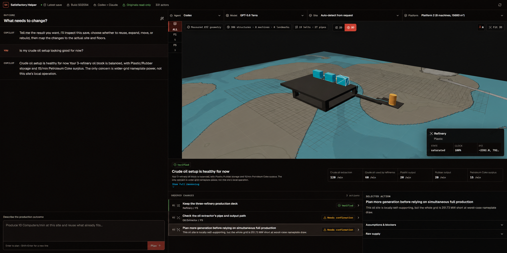

# Satisfactory Helper



Satisfactory Helper is a local planning workbench for vanilla Satisfactory. It reads a safe copy of the factory you actually built, combines that world state with data from your installed game, and uses your signed-in Codex or Claude subscription to answer ordinary questions such as:

> Can I make 10 Computers/min at my computer factory? Reuse what fits and tell me what to change by floor.

It follows the newest save, understands current milestones, MAM research, and unlocked hard-drive recipes, reconstructs factories in 2D and 3D, and produces buildable changes grounded in the current world instead of a blank calculator graph.

## What it does

- Reconstructs machines, foundations, belts, pipes, storage, miners, floors, walls, ramps, railings, and major structures from a save snapshot.
- Answers questions about existing factories and automatically decides whether a same-site change or an independent new factory is more practical.
- Uses current recipes, unlocked technology, local resource nodes, extractor capacity, belt limits, overclocking, and power state.
- Keeps locked alternate recipes in separate near-term unlock advice instead of using them in the current plan.
- Shows the real in-game map when it can be extracted from the local installation, with a measured-grid fallback.
- Supports Codex and Claude through their official local subscription CLIs. The Windows release bundles Codex; Claude remains an optional separate install.

## Save safety

Original `.sav` files are never passed to the parser or the planning agent. Satisfactory Helper only discovers and opens them for reading, waits until the newest file is stable, then copies it into `.local-data/snapshots`. The parser and agent tools receive only that private snapshot directory. The application contains no save-writing feature.

You can independently record and compare every original save before and after a session:

```powershell
./scripts/save-manifest.ps1 -OutputPath .local-data/safety/before.json
pnpm start
./scripts/save-manifest.ps1 -CompareTo .local-data/safety/before.json
```

Never place a real save in the repository. `*.sav`, credentials, generated map data, snapshots, and local conversations are ignored by Git.

## Choose an installation path

Satisfactory Helper currently targets Windows 10 or 11, a local Steam or Epic installation of Satisfactory, and unmodded saves. Choose one of the following paths.

### Option A: Windows release (recommended)

This is the normal player setup. Node.js, pnpm, Python, uv, Git, and an API key are **not** required.

1. Download `Satisfactory-Helper-<version>-windows-x64.zip` from the [latest release](https://github.com/tyagivivek8/satisfactory-helper/releases/latest).
2. Extract the complete ZIP to a regular folder. Do not run the application from inside the ZIP preview.
3. Double-click **Sign in to Codex.cmd** once.
4. Choose **Sign in with ChatGPT** in the Codex login flow.
5. Double-click **Satisfactory Helper.exe**.
6. Leave the small console window open while using the browser workbench. Close it, or press `Ctrl+C` in it, to stop the app.

The release contains the web interface, local server, Python runtime, read-only MCP tools, save parser, map generator, and native Codex CLI. It opens on <http://127.0.0.1:8713> and accepts connections from this computer only. Generated data and private save snapshots live under `%LOCALAPPDATA%\Satisfactory Helper`, separate from both the extracted application and the game's save directory.

Claude is optional and is not bundled. If the standalone [Claude Code](https://code.claude.com/docs/en/setup) executable is installed and signed in, Satisfactory Helper detects it and adds it to the Agent selector.

### Option B: Install and run from source

Use this path if you want to inspect, modify, or contribute to the source. The commands below are intended for PowerShell.

#### 1. Install the system tools

Install Git, a current Node.js LTS release (Node 22 or newer), and uv:

```powershell
winget install --id Git.Git -e
winget install --id OpenJS.NodeJS.LTS -e
winget install --id astral-sh.uv -e
```

Close and reopen PowerShell so the new commands are on `PATH`, then verify them:

```powershell
git --version
node --version
npm --version
uv --version
```

If `winget` is unavailable, use the official [Git for Windows](https://git-scm.com/download/win), [Node.js](https://nodejs.org/en/download), and [uv](https://docs.astral.sh/uv/getting-started/installation/) installers. You do not need to install Python separately; uv downloads and manages the required Python 3.13 runtime.

#### 2. Install pnpm and Codex

The repository pins pnpm 11.6.0 and a known-compatible version of the [official Codex CLI](https://github.com/openai/codex). Install both through npm:

```powershell
npm install --global pnpm@11.6.0 @openai/codex@0.151.0
pnpm --version
codex --version
```

Use the Codex version shown above for this Satisfactory Helper release. Startup rejects incompatible versions instead of risking incomplete factory inspections.

#### 3. Download the source

```powershell
git clone https://github.com/tyagivivek8/satisfactory-helper.git
Set-Location satisfactory-helper
```

#### 4. Sign in to a planning provider

For Codex, run:

```powershell
codex login
codex login status
```

Choose **Sign in with ChatGPT**. Codex uses the access and limits included with the signed-in ChatGPT plan; Satisfactory Helper does not need an OpenAI API key.

Claude can be used instead of, or alongside, Codex. Install [Claude Code](https://code.claude.com/docs/en/setup), then run `claude` and complete its browser login. At least one provider must be signed in before the app starts.

#### 5. Install project dependencies

From the repository root, run:

```powershell
pnpm setup
```

This installs the locked JavaScript packages, creates the local `.venv`, downloads Python 3.13 through uv when necessary, and installs the Python dependencies. It does not read or modify a Satisfactory save.

#### 6. Start the app

```powershell
pnpm start
```

Open <http://127.0.0.1:8713> in your browser. Keep the PowerShell window running; press `Ctrl+C` to stop the server. Use the Agent and Model dropdowns in the toolbar to choose the provider for future requests.

The first startup can take longer because the web app is built and the local in-game map is generated. Satisfactory Helper regenerates world-node, collectible, region, and map data after a game update. Generated files remain under `.local-data`; neither the game installation nor original saves are changed.

For later starts:

```powershell
Set-Location path\to\satisfactory-helper
pnpm start
```

To update a source installation:

```powershell
Set-Location path\to\satisfactory-helper
git pull --ff-only
pnpm start
```

`pnpm start` synchronizes locked dependencies and rebuilds the web interface, so no separate update command is necessary.

#### Nonstandard game or save locations

Standard Steam and Epic locations are detected automatically. If detection fails, create a local `.env` file before starting:

```powershell
Copy-Item .env.example .env
notepad .env
```

Set only the paths that differ on your computer:

| Variable | Purpose |
| --- | --- |
| `SATISFACTORY_SAVES` | Root containing local Satisfactory save folders |
| `SATISFACTORY_DOCS` | Installed `CommunityResources\Docs\en-US.json` |
| `SATISFACTORY_GAME_ROOT` | Nonstandard game root used for map extraction |
| `SATISFACTORY_HELPER_PORT` | Local HTTP port; defaults to `8713` |
| `SATISFACTORY_HELPER_CODEX_MODEL` | Optional Codex model override |
| `SATISFACTORY_HELPER_CLAUDE_MODEL` | Optional Claude model override |

## How provider subscriptions are used

Satisfactory Helper does not proxy, resell, or convert an AI subscription into an API credential. It runs the provider's official command-line tool on your computer and lets that tool use the account you already signed in with. The Windows ZIP includes the official Apache-2.0 native Codex CLI for convenience; source checkouts can use an existing Codex installation instead.

For Codex, run **Sign in to Codex.cmd** from the Windows release, or `codex login` from a source checkout, and choose **Sign in with ChatGPT**. At startup, Satisfactory Helper checks `codex login status`; for a request it launches `codex exec` with the model selected in the toolbar. Codex owns the login session and applies the access and usage limits of the signed-in ChatGPT account.

For Claude, run `claude` and follow the browser login prompts. At startup, Satisfactory Helper checks `claude auth status --json`; for a request it launches Claude Code in print mode with the selected model. Claude Code requires an eligible Anthropic subscription or Console account. If `ANTHROPIC_API_KEY` is already set in the environment, Claude Code can use that key instead, which follows the billing rules of that API account.

The web application never receives your provider password and does not store provider access tokens. Authentication remains inside the locally installed Codex or Claude CLI. Each planning request receives only:

- Your question and the recent conversation shown in the workbench.
- The provider and model selected for that request.
- Read-only MCP tools connected to one pinned save snapshot.
- Parsed factory state and game data extracted from your local Satisfactory installation.

The agent never receives the path to an original save and cannot write to a save. Changing Agent or Model affects only future planning requests; it does not change the snapshot, factory, or game installation.

## Development

```powershell
pnpm setup
pnpm dev
```

The Vite development server runs at <http://127.0.0.1:5173> and proxies the local API. Run the complete project checks with:

```powershell
pnpm check
```

Create the same self-contained archive locally with:

```powershell
./packaging/build-windows.ps1 -Version dev
```

Pushing a `v*` tag runs the Windows release workflow and attaches the ZIP to a GitHub Release. Node, pnpm, Python, and uv are build-time dependencies only; they are not required on the player's machine.

See [CONTRIBUTING.md](CONTRIBUTING.md) before submitting changes and [SECURITY.md](SECURITY.md) for private vulnerability reporting guidance.

## Source, license, and attribution

This is public source, not an OSI-approved open-source release. Satisfactory Helper is available for noncommercial use under the [PolyForm Noncommercial License 1.0.0](LICENSE). Commercial use requires separate permission from every relevant rights holder.

The repository vendors a trimmed, modified runtime subset of [SatisfactoryMCP](https://github.com/lukszi/SatisfactoryMCP) from revision `ade73e6c4736937eb49cc54364def7d6b30873d6`. Upstream player-derived fixtures and internal development notes are excluded. Its original license and required notice remain in [`vendor/SatisfactoryMCP/LICENSE`](vendor/SatisfactoryMCP/LICENSE). Modification details and other notices are in [THIRD_PARTY_NOTICES.md](THIRD_PARTY_NOTICES.md).

Required Notice: Copyright Lukas Szimtenings ([SatisfactoryMCP](https://github.com/lukszi/SatisfactoryMCP))

Satisfactory, its game data, names, and assets belong to Coffee Stain Studios and their respective rights holders. Satisfactory Helper is an unofficial community project and is not affiliated with or endorsed by Coffee Stain Studios.
